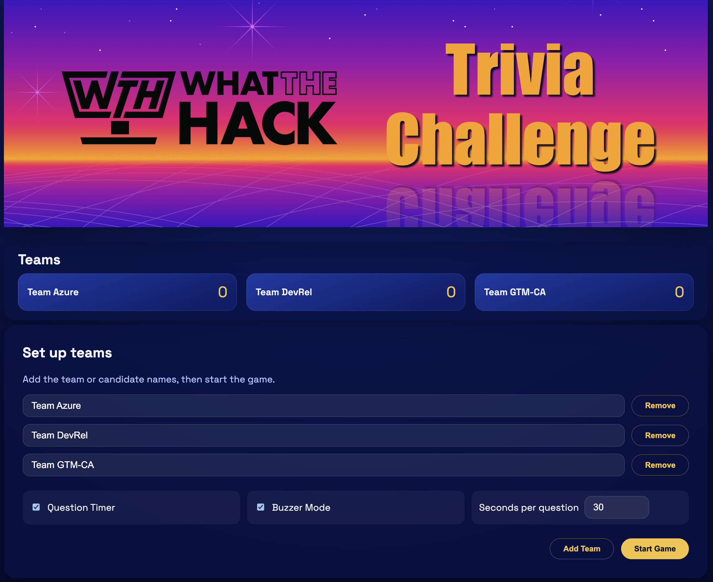
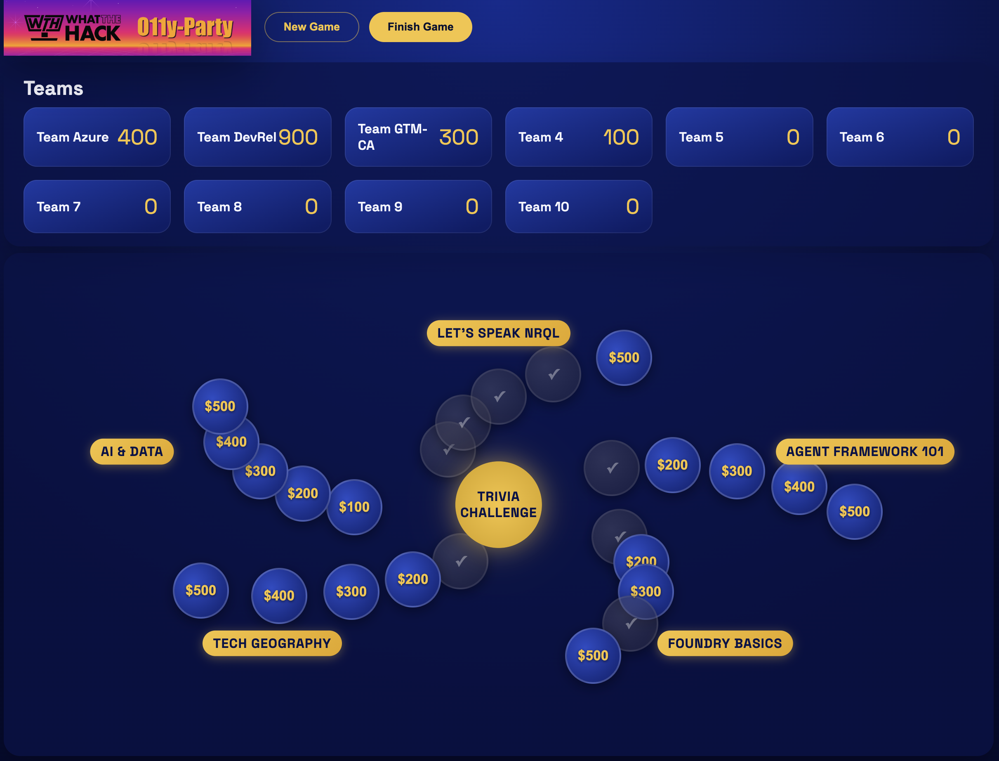
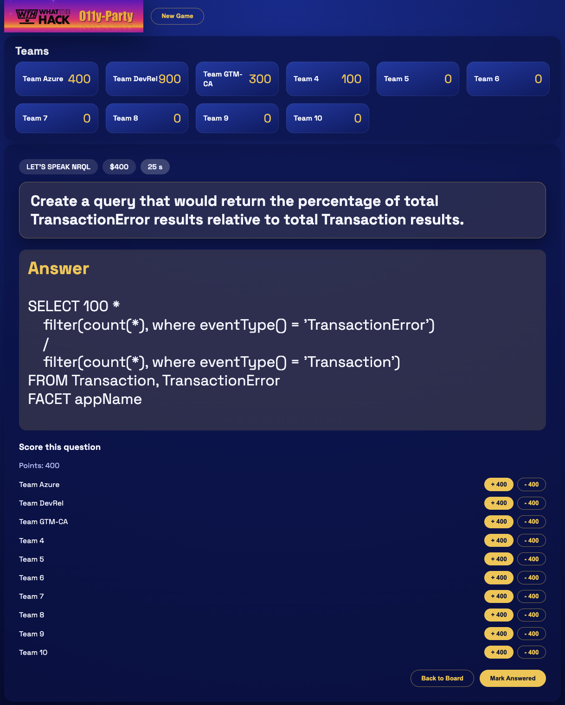
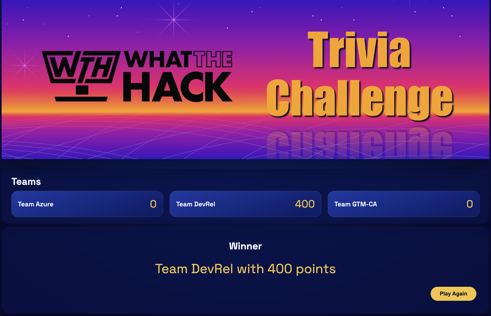

# WhatTheHack - Trivia Challenge


This is a simple trivia-style game built with .NET 10 and ASP.NET Core Blazor.

It can be used for fun team-building activities, educational purposes, or as a template for building more complex quiz games. The game features a customizable board with categories and point values, and allows players to select clues, reveal answers, and keep track of their scores.

It also includes optional integration with New Relic Browser monitoring for insights into user interactions and game performance.

## Prerequisites

- .NET SDK 10.0 (or later)
  - Download from: <https://dotnet.microsoft.com/en-us/download>
- Optional: Visual Studio 2022/2025 or VS Code with the C# Dev Kit

## Getting Started

1. Open a terminal in this folder.
2. Restore dependencies:

    ```bash
    dotnet restore
    ```

## (optional) Configure New Relic Browser Monitoring

To enable New Relic Browser monitoring for this application, follow these steps:

1. Sign up for a New Relic account if you don't have one: <https://newrelic.com/signup>
2. Create a New Relic Browser monitoring application in your New Relic account to get the monitoring script.
3. Copy the New Relic Browser monitoring script provided by New Relic.
4. Open the file [wwwroot/newrelic.js](wwwroot/newrelic.js) in a text editor.
5. Paste the New Relic Browser monitoring script into the file, replacing the placeholder comment.
6. Uncomment the lines in the `RecordTeamScore` function to enable recording team names and scores as custom attributes in New Relic for better insights into user interactions and game performance.
7. Save the file.

## Running the Game

1. Run the app:

    ```bash
    dotnet run
    ```

2. Open the URL shown in the terminal (typically `https://localhost:7xxx`).

## Running Tests

### Run All Tests (Quick Path)

```bash
# 1) Run unit tests
dotnet test Tests/WthTriviaChallenge.UnitTests/WthTriviaChallenge.UnitTests.csproj

# 2) Start app for E2E tests (expected at http://localhost:5122)
dotnet run --project WthTriviaChallenge.csproj --urls http://localhost:5122 &

# 3) Run E2E tests
dotnet test Tests/WthTriviaChallenge.Tests/WthTriviaChallenge.Tests.csproj
```

### Unit Tests

The project includes NUnit unit tests in `Tests/WthTriviaChallenge.UnitTests/`. These test the `TriviaDataService` (board cloning, fallback data, team loading) and do not require the app to be running.

```bash
#cd Tests/WthTriviaChallenge.UnitTests
dotnet test Tests/WthTriviaChallenge.UnitTests/WthTriviaChallenge.UnitTests.csproj
```

To run a specific test:

```bash
dotnet test Tests/WthTriviaChallenge.UnitTests/WthTriviaChallenge.UnitTests.csproj --filter "GetBoardAsync_ReturnsIndependentClones"
```

### End-to-End Tests (Playwright)

The project also includes Playwright E2E tests in `Tests/WthTriviaChallenge.Tests/`. These tests simulate user interactions with the app in a real browser and require the app to be running at `http://localhost:5122`.

#### First-Time Setup

Install the Playwright browsers (requires a one-time build first):

```bash
cd Tests/WthTriviaChallenge.Tests
dotnet build
PLAYWRIGHT_DRIVER_SEARCH_PATH="$(pwd)/bin/Debug/net10.0" \
  dotnet exec bin/Debug/net10.0/Microsoft.Playwright.dll install chromium
```

#### Running the Tests

The tests expect the app to be running on `http://localhost:5122`:

```bash
# Start the app in the background
dotnet run --urls http://localhost:5122 &

# Run all tests
#cd Tests/WthTriviaChallenge.Tests
dotnet test Tests/WthTriviaChallenge.Tests/WthTriviaChallenge.Tests.csproj

# Run a single test
dotnet test Tests/WthTriviaChallenge.Tests/WthTriviaChallenge.Tests.csproj --filter "HomepageLoadsWithTitleAndLogo"
dotnet test Tests/WthTriviaChallenge.Tests/WthTriviaChallenge.Tests.csproj --filter "FullGameFlow_SetupThroughWinner"
```

## Customizing the Game

- Questions and answers live in [wwwroot/data/trivia-board.json](wwwroot/data/trivia-board.json).

  - Prompts are the on-screen clues.
  - Answers are the responses players should phrase as a question.

- Initial team names live in [wwwroot/data/teams.json](wwwroot/data/teams.json).

## Game Controls

- Use **New Game** to reset teams and the board.
- Select a tile to reveal the clue.
- Use **Show Answer** to reveal the response.
- Use the scoring buttons to award or deduct points.

## Troubleshooting

- If the HTTPS dev certificate is missing, run:

```bash
dotnet dev-certs https --trust
```

## Screenshots

### Setup View



### Start View



### Prompt View



### Winner View


